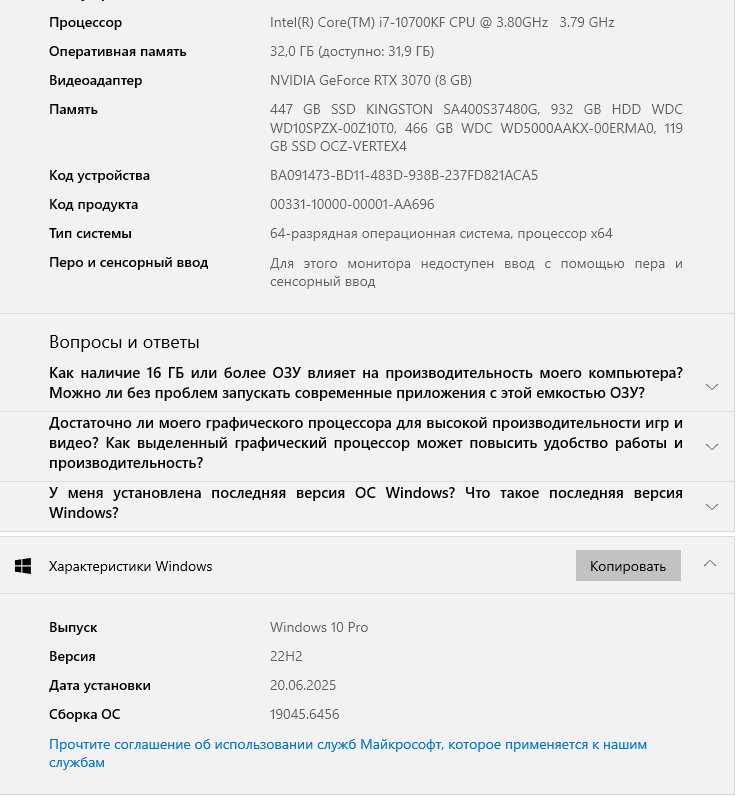

**6. Часть С. Проверить данные двумя способами**

| Характеристика | Способ 1 | Способ 2 | Совпало? / комментарий |
| :--- | :--- | :--- | :--- |
| Версия Windows | winver | msinfo32 / Параметры | **Совпало.** И утилита winver, и окно «Параметры» показывают идентичные данные: Windows 10 Pro, версия 22H2. *(Примечание: так как 1 часть задания я делал на ПК в колледже, эти значения могут отличаться от характеристик в начале отчета).* |
| Модель процессора | Параметры / msinfo32 | Диспетчер задач → CPU | **Совпало.** Диспетчер задач во вкладке Производительность подтверждает данные c msinfo32 установлен процессор Intel(R) Core(TM) i7-10700KF CPU @ 3.80GHz. *(Примечание: так как 1 часть задания я делал на ПК в колледже, эти значения могут отличаться от характеристик в начале отчета).* |
| Объём RAM | Параметры / msinfo32 | Диспетчер задач → Memory | **Совпало.** Диспетчер задач фиксирует общий объем оперативной памяти 32ГБ, что совпадает с msinfo32. *(Примечание: так как 1 часть задания я делал на ПК в колледже, эти значения могут отличаться от характеристик в начале отчета).* |

