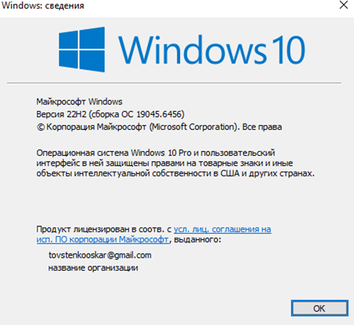
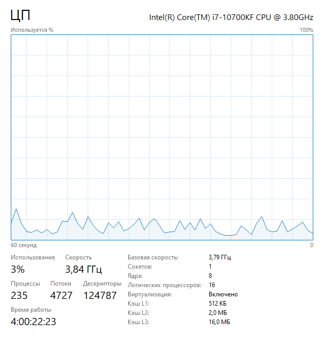
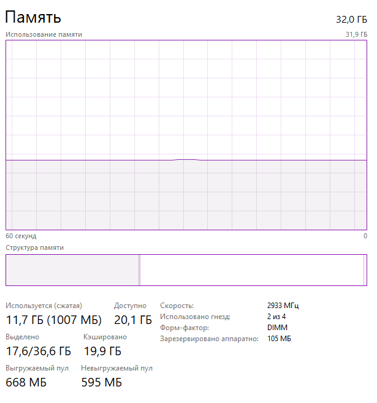
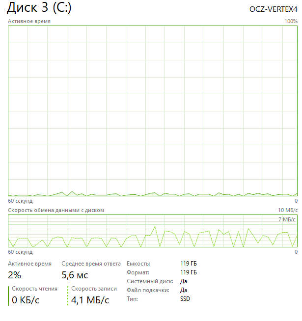
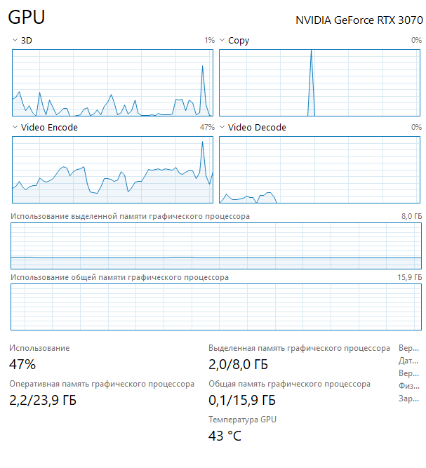

## Паспорт системы
| Что исследовать | Мои данные |
| :--- | :--- |
| **Операционная система** | *Windows 10 Pro, версия 22H2, сборка 19045.6456* |
| **Архитектура** | *64-разрядная ОС, процессор x64* |
| **Процессор** | [Intel core i7-10700; физические ядра 8; логические процессоры 16; текущую загрузку 3%] |
| **Оперативная память** | [объём 32gb; сколько занято в момент проверки 11gb] |
| **Накопители** | *SSD; 512gb; свободное место системного диска 217  |
| **Видеосистема** | rtx3070; 2% |
| **Системные компоненты** | BIOS/UEFI ver HP Q02 Ver 02.30.00 ; состояние виртуализации вкл|
| **Среда работы** | *установлен ли Visual Studio code. Python ver 3.12 * |

**дата диагностики 13.10.2026**

**Вывод:**
Данный ПК подходит для профессионального программирования, развертывания виртуальных машин и комфортной работы с Linux-средами.

**Аргументация:**
* **CPU:** Мощный многоядерный процессор (8 ядер, 16 потоков) легко справится с многопоточной компиляцией кода, запуском Docker-контейнеров и вычислениями внутри виртуальных сред без зависаний и ущерба для основной системы.
* **RAM:** Объем в 32 ГБ. Его хватит для одновременной работы тяжелых сред разработки IDE, браузера с множеством вкладок и параллельного запуска сразу нескольких виртуальных машин (например, можно спокойно выделить 2-3 виртуалкам по 4–8 ГБ памяти).
* **Дисковая подсистема:** У меня на комьюторе находится несколько жестких дисков с разными обьемами от 128 до 1тб этого обьема хватит для скачивания и использования виртуальой машины.
* **Виртуализация:** Аппаратная виртуализация полностью поддерживается и уже включена в системе.